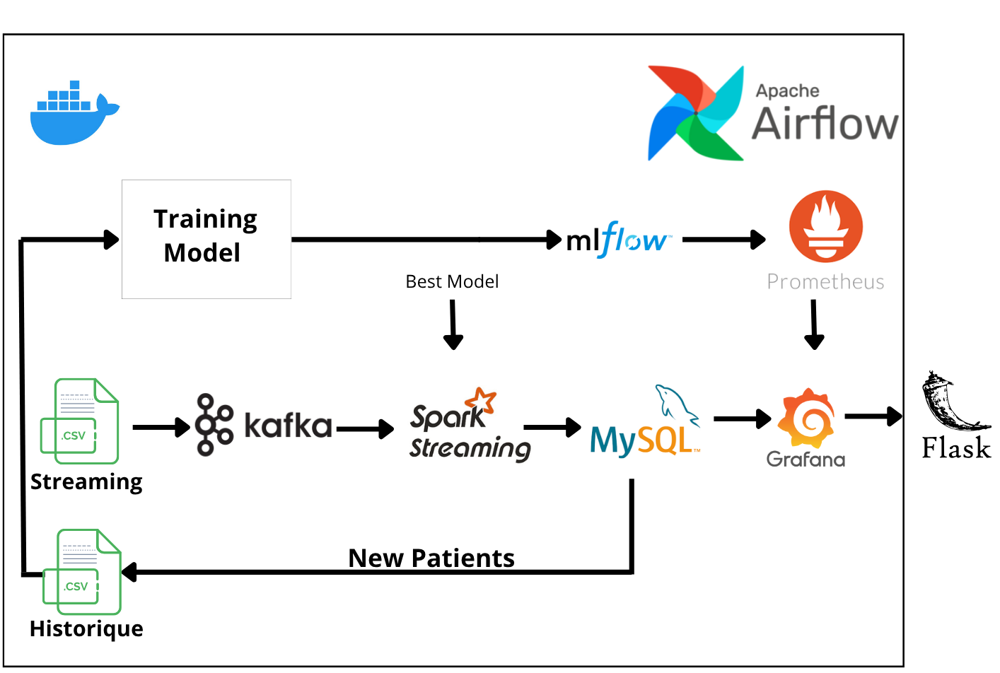

# Diabetic Readmission Prediction - Pipeline Data Engineering & MLOps

Projet de **Data Engineering** implementant un pipeline MLOps de bout en bout pour la **prediction de readmission de patients diabetiques**. Le systeme couvre l'ensemble du cycle de vie de la donnee : ingestion en temps reel via Kafka, traitement distribue avec Spark Structured Streaming, stockage dans MySQL, re-entrainement automatique des modeles ML, tracking des experiences avec MLflow, monitoring avec Prometheus, et visualisation via des dashboards Grafana exposes dans une application Flask.

## Architecture



### Flux de donnees

1. **Kafka Producer** — lit `streaming_data.csv` ligne par ligne et publie sur le topic Kafka (1 message / 8s)
2. **Spark Streaming** — consomme depuis Kafka, applique le feature engineering (mapping des codes diagnostics, gestion des nulls), execute les predictions avec le modele broadcast, ecrit les resultats dans MySQL
3. **Retraining** — extrait les donnees accumulees de MySQL, fusionne avec l'historique, entraine 5 modeles (RandomForest, LightGBM, XGBoost, LogisticRegression, DecisionTree), selectionne le meilleur par recall/AUC/accuracy, log dans MLflow
4. **Metrics Server** — expose les metriques des modeles sur le port 8002 pour le scraping Prometheus
5. **Flask App** — interface web avec 3 sections : Medecine (dashboards Grafana/MySQL), IT (dashboards Grafana/Prometheus), Chatbot (assistant Gemini 1.5 Flash)

### DAG Airflow

Le DAG `readmission_pipeline` s'execute en boucle continue (chaque run declenche le suivant) :

```
cleanup --> create_kafka_topic --> run_streaming_pipeline --> check_services --> run_retraining --> trigger_next_run
```

## Technologies

| Composant | Technologie | Version |
|---|---|---|
| Orchestration | Apache Airflow (Astro Runtime) | 3.0-2 |
| Streaming | Apache Spark Structured Streaming | 3.4.3 |
| Message Broker | Apache Kafka | 7.3.0 (Confluent) |
| Base de donnees | MySQL | 8.0 |
| ML Tracking | MLflow | latest |
| Monitoring | Prometheus + Grafana | latest |
| Web App | Flask + Gemini 1.5 Flash | - |
| Langage | Python | 3.12 |
| JVM | OpenJDK / Temurin | 17 |

## Prerequisites

- [Docker](https://docs.docker.com/get-docker/) et Docker Compose
- [Astro CLI](https://www.astronomer.io/docs/astro/cli/install-cli)
- ~8 Go de RAM disponible pour les conteneurs

## Installation

### 1. Cloner le repo

```bash
git clone <repo-url>
cd airflow_spark
```

### 2. Configurer les variables d'environnement

```bash
cp .env.example .env
```

Editer `.env` et remplir les valeurs (en particulier `MYSQL_PASSWORD` et `GEMINI_API_KEY`).

### 3. Builder l'image Spark

```bash
docker build -f Dockerfile.spark -t custom-spark:latest .
```

### 4. Configurer le port Postgres (si conflit)

Si le port 5432 est deja utilise sur votre machine :

```bash
astro config set postgres.port 5435
```

### 5. Demarrer le projet

```bash
astro dev start
```

Cette commande demarre **tous les services** : Airflow, Spark (master + worker), Kafka, Zookeeper, MySQL, MLflow, Prometheus, Grafana, Flask, et le serveur de metriques.

### 6. Configurer la connexion Spark dans Airflow

1. Ouvrir Airflow UI : http://localhost:8080
2. Aller dans **Admin > Connections > +**
3. Remplir :
   - **Connection Id** : `my_spark_conn`
   - **Connection Type** : `Spark`
   - **Host** : `spark://spark-master`
   - **Port** : `7077`

### 7. Lancer le pipeline

Dans Airflow UI, activer et declencher le DAG **`readmission_pipeline`**. Le pipeline tourne ensuite en boucle automatiquement.

## Interfaces Web

| Service | URL | Description |
|---|---|---|
| Airflow | http://localhost:8080 | Orchestration des DAGs |
| Spark Master | http://localhost:8081 | Monitoring Spark |
| MLflow | http://localhost:5000 | Tracking des experiences ML |
| Grafana | http://localhost:3000 | Dashboards de visualisation |
| Prometheus | http://localhost:9090 | Metriques de monitoring |
| Flask App | http://localhost:5001 | Interface web principale |

## Structure du projet

```
airflow_spark/
├── dags/
│   └── readmission_pipeline.py    # DAG Airflow principal
├── include/
│   ├── data/                      # Datasets CSV (git-ignored)
│   ├── jars/                      # JARs Spark (git-ignored)
│   ├── mlflow/                    # Artefacts MLflow (git-ignored)
│   ├── models/                    # Modeles serialises (git-ignored)
│   └── scripts/
│       ├── kafka_producer.py      # Producteur Kafka
│       ├── spark_consumer.py      # Consommateur Spark Streaming
│       ├── retraining.py          # Re-entrainement des modeles
│       ├── metrics_server.py      # Serveur Prometheus
│       ├── app.py                 # Application Flask
│       └── cleanup_resources.py   # Nettoyage entre les runs
├── grafana/
│   ├── dashboards/                # Dashboards JSON provisiones
│   └── provisioning/              # Config datasources + providers
├── Dockerfile                     # Image Airflow custom
├── Dockerfile.spark               # Image Spark custom
├── docker-compose.override.yml    # Services additionnels
├── prometheus.yml                 # Config Prometheus
├── requirements.txt               # Dependances Python Airflow
├── .env.example                   # Template variables d'environnement
└── .env                           # Variables d'environnement (git-ignored)
```

## Arret du projet

```bash
astro dev stop
```

## Notes importantes

- **Spark 3.4.3 + Java 17** : Spark 3.4.3 necessite Java 17 (pas 21+). Java 21 provoque `NoSuchMethodException: java.nio.DirectByteBuffer`.
- **Python 3.12** : la version Python doit etre identique entre le driver Airflow et les workers Spark. Un mismatch provoque `PySpark cannot run with different minor versions`.
- **JARs** : les JARs dans `include/jars/` doivent correspondre aux versions Spark/Scala (Scala 2.12, Spark 3.4.x).
- **Timing** : le producer envoie 1 message toutes les 8 secondes pendant ~50 secondes. Le consumer Spark s'arrete aussi apres 50 secondes. Ces valeurs sont configurables dans `kafka_producer.py` (`DURATION_SECONDS`) et `spark_consumer.py` (`timeout_seconds`).
- **Selection du meilleur modele** : comparaison hierarchique — recall en premier, puis AUC, puis accuracy (avec des seuils configurables).
